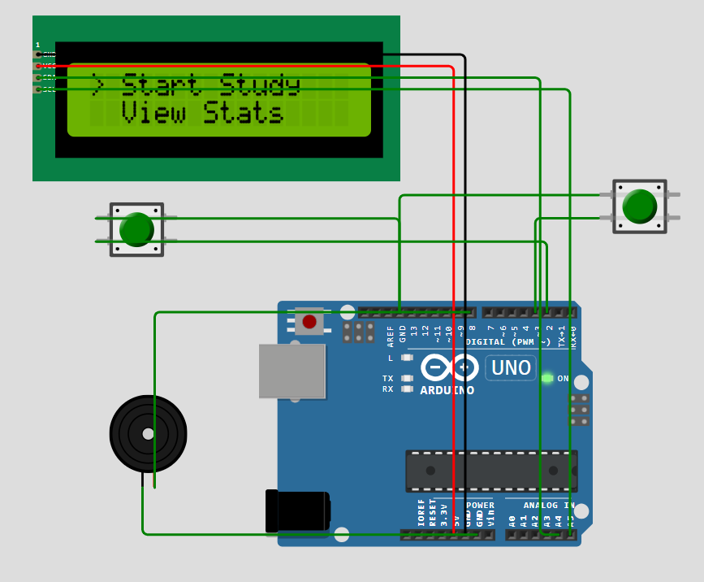
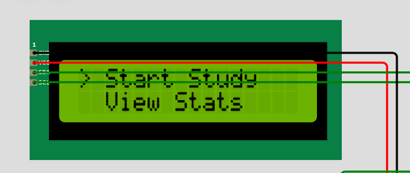
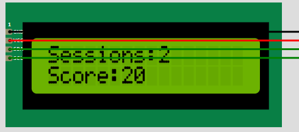
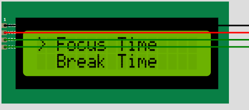
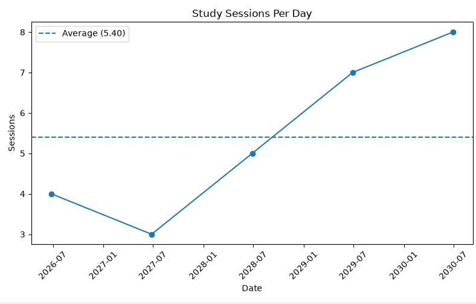

# Smart Study Desk

A productivity-focused project that combines an Arduino-powered study desk with a Python analytics dashboard.

## Overview

The Smart Study Desk helps students stay focused during study sessions and track their productivity over time.

The project consists of two parts:

1. An Arduino system that manages focus sessions, break sessions, productivity scoring, and menu navigation through an LCD display.
2. A Python dashboard that stores study data, generates statistics, visualizes trends, and exports reports.

## Features

### Arduino System

* Focus timer
* Break timer
* LCD menu interface
* Session tracking
* Productivity score tracking
* Settings menu
* Wokwi simulation support

### Python Dashboard

* CSV-based data storage
* Study session analytics
* Average productivity calculations
* Best study day detection
* Goal tracking
* Data visualization with Matplotlib
* Report export

## Technologies Used

* Arduino C++
* Wokwi
* Python
* Pandas
* Matplotlib
* Git
* GitHub

## Repository Structure

Arduino/ contains the Arduino code and Wokwi project files.

PythonDashboard/ contains the analytics dashboard, graphing tools, and report generation scripts.

Screenshots/ will contain project images and demonstrations.

## Future Improvements

* PDF report generation
* Study streak tracking
* Real-time Arduino-to-Python integration
* AI-powered productivity insights

## Author

Michael Etukudoh

## Screenshots

### Circuit Overview

### Main Menu

### Statistics Screen

### Settings Menu

### Study Analytics Graph

